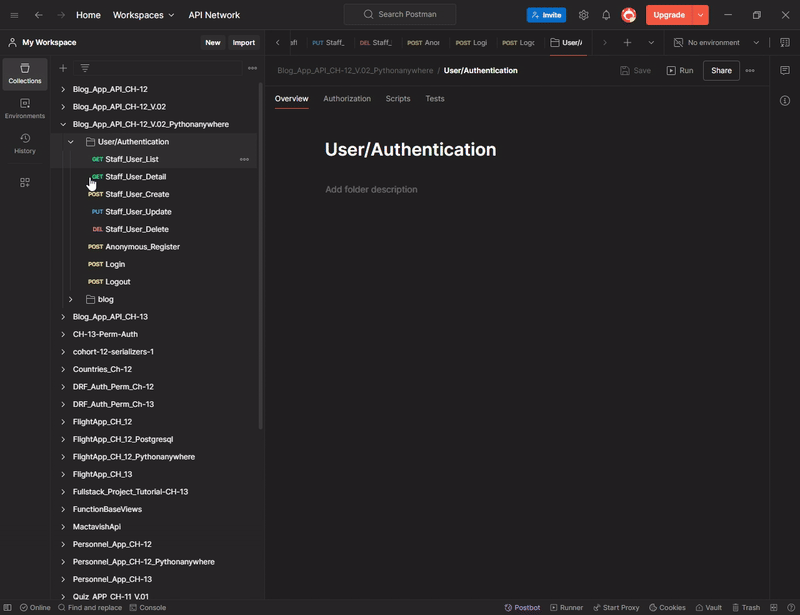
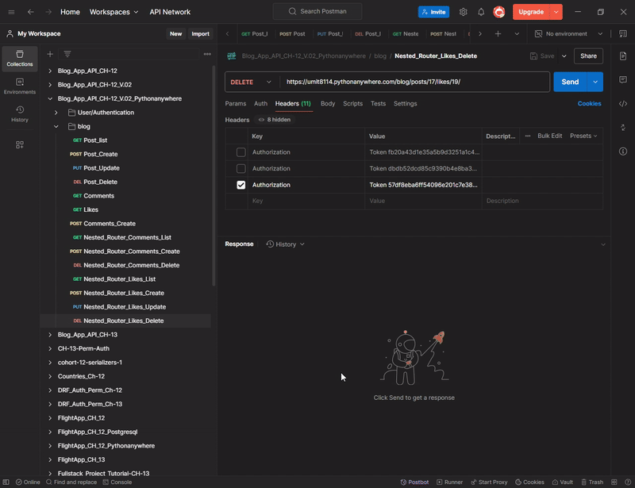

<!-- Please update value in the {}  -->
<p align="center">
  
  
  
  
</p>

<h1 align="center">📝 Blog REST API</h1>

<p align="center">
A production-ready Blog API built with Django REST Framework featuring authentication,
CRUD operations, comments, likes and nested resources.
</p>

<!-- <p align="center">🚀 Kullanıcıların blog oluşturmasına, yorum yapmasına ve diğer kullanıcılarla etkileşim kurmasına olanak tanıyan bir API 🚀</p> -->

<!-- <div align="center">
  <h3>
    <a href="https://umit8114.pythonanywhere.com/">
      Demo
    </a>
     | 
    <a href="https://umit8114.pythonanywhere.com/">
      Project
    </a>
 
  </h3>
</div> -->

<!-- TABLE OF CONTENTS -->

## Navigation

- [API Endpoints](#api-endpoints)
  - [User/Authentication Endpoints:](#userauthentication-endpoints)
  - [Blog Endpoints:](#blog-endpoints)
  - [Comment Endpoints:](#comment-endpoints)
- [API Testing](#api-testing)
- [Overview](#overview)
  - [User Authentication Test](#user-authentication-test)
  - [Blog App CRUD Test](#blog-app-crud-test)
- [Built With](#built-with)
- [How To Use](#how-to-use)
  - [Example Usage](#example-usage)
- [About This Project](#about-this-project)
- [Key Features](#key-features)
- [Contact](#contact)


## API Endpoints

All endpoints are RESTful and protected via token-based authentication
where required.


### User/Authentication Endpoints:

| Method | URL                                                          | Explanation          |
|--------|--------------------------------------------------------------|----------------------|
| POST   | `https://umit8114.pythonanywhere.com/users/register/`        | New user registration|
| POST   | `https://umit8114.pythonanywhere.com/users/auth/login/`      | User login           |
| POST   | `https://umit8114.pythonanywhere.com/users/auth/logout/`     | User logout          |


### Blog Endpoints:

| Method | URL                                                  | Explanation           |
|--------|------------------------------------------------------|-----------------------|
| GET    | `https://umit8114.pythonanywhere.com/blog/posts/`    | List all posts        |
| POST   | `https://umit8114.pythonanywhere.com/blog/posts/`    | Create a new post     |
| GET    | `https://umit8114.pythonanywhere.com/blog/posts/14/` | Specific post details |
| PUT    | `https://umit8114.pythonanywhere.com/blog/posts/14/` | Post update           |
| DELETE | `https://umit8114.pythonanywhere.com/blog/posts/16/` | Post delete           |


### Comment Endpoints:
| Method | URL                                                  | Explanation          |
|--------|------------------------------------------------------|----------------------|
| GET    | `https://umit8114.pythonanywhere.com/blog/comments/` | List post comments   |
| POST   | `https://umit8114.pythonanywhere.com/blog/comments/` | Add a new comment    |


## API Testing

Postman Collection contains the necessary requests to test each endpoint of your API. You can use it to quickly understand the functionality of the API.

To test APIs via Postman, you can follow the steps below:

1. Install Postman (if not installed): [Postman İndir](https://www.postman.com/downloads/).
2. This [Postman Collection](https://umit-dev.postman.co/workspace/Team-Workspace~7e9925db-bf34-4ab9-802e-6deb333b7a46/collection/17531143-00b58f75-ce21-4f00-9e94-24eaec4d32b0?action=share&creator=17531143) download and import.
3. Start testing APIs via Postman.

**Postman Collection Link:**  
[Blog App API Postman Collection](https://umit-dev.postman.co/workspace/Team-Workspace~7e9925db-bf34-4ab9-802e-6deb333b7a46/collection/17531143-00b58f75-ce21-4f00-9e94-24eaec4d32b0?action=share&creator=17531143)


## Overview

The Blog API application allows users to create blogs, comment, and interact with other users. This application provides:
- Token-based authentication & authorization
- Blog & Comment CRUD operations
- Like system
- Nested resources using drf-nested-routers


### User Authentication Test
<!--  -->


➡ Testing user authentication processes with Postman.


### Blog App CRUD Test
<!--  -->


➡ Testing CRUD operations on the Blog App API with Postman.


## Built With

<!-- This section should list any major frameworks that you built your project using. Here are a few examples.-->

This project is built with the following tools and libraries:

- [Django Rest Framework](https://www.django-rest-framework.org/) - A powerful framework for developing REST APIs.
- [dj-rest-auth](https://dj-rest-auth.readthedocs.io/en/latest/) - User authentication and authorization.
- [drf-nested-routers](https://github.com/alanjds/drf-nested-routers) - Hierarchical routing.


## How To Use

<!-- This is an example, please update according to your application -->

To clone and run this application, you'll need [Git](https://github.com/Umit8098/Project_Django_Rest_Framework_Blog_App_CH-12_V.02.git) 

When installing the required packages in the requirements.txt file, review the package differences for windows/macOS/Linux environments. 

Complete the installation by uncommenting the appropriate package.

```bash
# Clone this repository
$ git clone https://github.com/Umit8098/Project_Django_Rest_Framework_Blog_App_CH-12_V.02.git

# Install dependencies
    $ python -m venv env
    $ python3 -m venv env (for macOs/linux OS)
    $ env/Scripts/activate (for win OS)
    $ source env/bin/activate (for macOs/linux OS)
    $ pip install -r requirements.txt
    $ python manage.py migrate (for win OS)
    $ python3 manage.py migrate (for macOs/linux OS)

# Create and Edit .env
# Add Your SECRET_KEY in .env file

"""
# example .env;

SECRET_KEY =123456789abcdefg...

"""

# Run the app
    $ python manage.py runserver
```

- After cloning the app and installing the dependencies, you can follow these steps:

### Example Usage

1. **Login Request:**
   - URL: `https://umit8114.pythonanywhere.com/users/auth/login/`
   - Method: `POST`
   - Body (JSON):
```json
  {
  "email": "umit@gmail.com",
  "password": "umit123456"
  }
```

2. **Post Create:**
   - URL: `https://umit8114.pythonanywhere.com/blog/posts/`
   - Method: `POST`
   - Headers:
  
```text
  Authorization: Token <token key returned when logged in>
```
- 
  - Body (JSON):

```json
  {
  "title": "fifth Post",
  "content": "Second Content",
  "image": "https://upload.wikimedia.org/wikipedia/commons/thumb/0/0c/Sport_balls.svg/400px-Sport_balls.svg.png",
  "is_published": true 
  }
```

## About This Project

- This is an API service for a blog application built with Django Rest Framework.
- Users can register, write blogs, comment on blogs and like them.


## Key Features

- **Blog Management:** Users can write, update and delete blogs.
- **Comment and Like:** Can comment and add likes to blogs.
- **User Authorization:** User registration, login and profile management.
- **Hierarchical Data Structure:** Advanced data management with drf-nested-routers.


## Contact

<!-- - Website [your-website.com](https://{your-web-site-link}) -->
- **GitHub**: [@Umit8098](https://github.com/Umit8098)

- **LinkedIn**: [@umit-arat](https://linkedin.com/in/umit-arat/)
<!-- - Twitter [@your-twitter](https://{twitter.com/your-username}) -->
